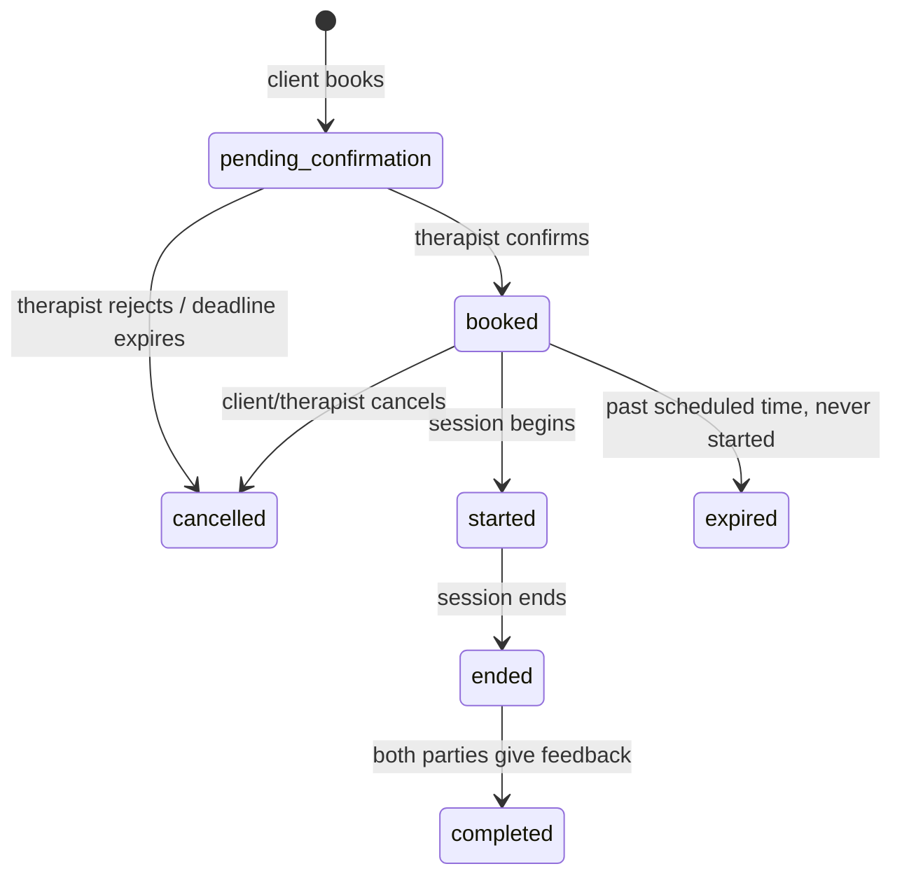

# Diagrams Guide

Use Mermaid diagrams to visualize relationships that are hard to follow in prose. Mermaid renders in GitHub, VS Code, and most markdown viewers — no external tools needed.

## When to Include Diagrams

- Architecture docs — component relationships, layer dependencies
- Data flow docs — request lifecycle, event pipelines
- Feature docs with state machines — meeting status transitions, payment states
- Integration docs — OAuth flows, sync sequences

## Diagram Types

| Type | Use For | Example |
|------|---------|---------|
| `flowchart` | Decision trees, process flows | Booking flow, cancellation logic |
| `sequenceDiagram` | Multi-party interactions over time | OAuth handshake, API call chains |
| `stateDiagram-v2` | Status/lifecycle transitions | Meeting states, payment states |
| `erDiagram` | Database relationships | Schema overview for a module |

## Example — State Diagram for a Meeting Lifecycle

````

````

## Best Practices

- Keep diagrams focused — if a diagram needs more than ~15 nodes, split it into multiple diagrams by subsystem
- A cluttered diagram is worse than no diagram
- Use descriptive labels on transitions
- Match terminology to the rest of the document
