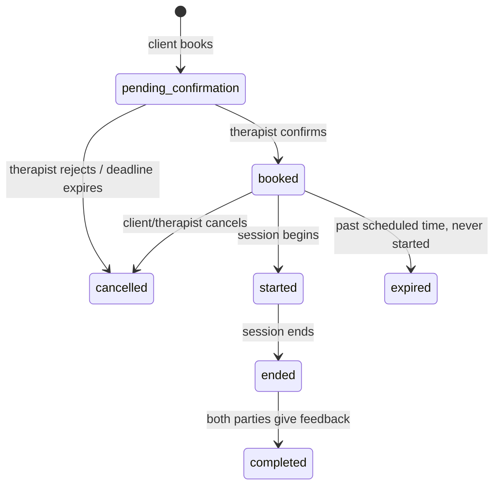

# Creating Documentation

A structured process for creating and updating project documentation. Documents use **reference-based notation** (function names, table names, file paths) rather than code snippets or line numbers, because references stay accurate as code evolves while line numbers and copied code rot immediately.

## Process

1. **Check for project guidelines** — Look for existing documentation guidelines in the project (e.g., `docs/DOCUMENTATION_GUIDELINES.md`, `CONTRIBUTING.md`). If the project has its own doc standards, follow those and use this skill only to fill gaps.
2. **Gather information** — Read all relevant source files, check for existing docs, and map how components connect. Build a mental inventory of file paths, functions, tables, endpoints, env vars, and external services involved. Do not start writing until you understand the full picture — docs written from partial understanding mislead readers.
3. **Choose document type** — Identify which sections apply (see Document Types below). Most docs blend categories — pick the sections that serve the reader, don't force a single type.
4. **Write using the template** — Fill in the template structure below. If updating an existing doc, read it first, change only affected sections, and update the Date in metadata.
5. **Add Key References** — For docs referencing 5+ files/functions/tables, add a summary table at the end (see format below). Short docs that only touch 2-3 files can skip this.
6. **Log TODOs and issues** — If you discover incomplete features, bugs, or planned work during research, add them to `docs/TODO.md` or `docs/ISSUES.md` (create these files if they don't exist). Never embed TODOs or issues in the documentation itself.
7. **Check size and split if needed** — After writing, check if the doc should be split (see Document Size and Splitting below). Proactively suggest splitting to the user if the doc covers 3+ distinct subsystems at 80+ lines each.
8. **Cross-reference** — Link to related docs and update them if your new doc changes the picture.

## Where to Save

Place docs where readers will find them:
- `docs/` directory if the project has one (most common)
- Alongside the code they describe (e.g., `src/auth/AUTH.md`) for module-specific docs
- Project root for high-level architecture docs
- If unsure, ask the user

## Document Template

The metadata header (Date/Status/Related) is recommended for discoverability but not mandatory — match the style of existing docs in the project.

```
# [Document Title]

**Date**: YYYY-MM-DD
**Status**: Draft | Active | Deprecated
**Related**: `doc1.md`, `doc2.md`

## Overview

[1-3 sentences: What this document covers and why it exists]

## [Body Sections]

[Pick sections from Document Types below based on what the reader needs]

## Key References

[Include for docs with 5+ referenced files/functions/tables]

## Related Documents

[Links to related docs with brief description of relationship]
```

## Reference Notation

Use reference names instead of line numbers. Line numbers shift with every edit; function names and file paths are stable and greppable.

| Element | Format |
|---------|--------|
| Functions | `functionName()` |
| Files | `path/from/root` |
| Tables | `table_name` |
| Columns | `table.column` or `column` in context |
| Endpoints | `METHOD /path` |
| Env vars | `VAR_NAME` |

**Code snippets** are valuable when they help the reader understand the actual interface — JSON request/response examples for APIs, SQL schema definitions, config formats, query key structures, or algorithms that are unclear in prose. API docs especially benefit from concrete request/response examples. Keep snippets focused on the interface, not implementation internals.

## Document Types

Pick the sections that fit your document. Most real docs blend these categories.

### API Reference

For endpoint-by-endpoint documentation. Each endpoint should include enough detail for a developer to integrate without reading the source code.

**Per-endpoint structure:**
- **Endpoint** — `METHOD /path`
- **Description** — What it does, in one line
- **Access** — Auth requirements, role, rate limits
- **Files** — Types, validator, service, controller, route (helps developers find the implementation)
- **Flow** — Numbered steps showing what happens server-side
- **Request** — Body fields with types, required/optional, constraints
- **Response** — JSON example with field descriptions
- **Errors** — Status codes and when they occur
- **Notes** — Edge cases, gotchas, related behavior

For docs with many endpoints, start with a summary table (`Method | Endpoint | Description`), then detail each one. Add a **Table of Contents** for docs with 10+ endpoints.

### System / Architecture

| Section | Purpose |
|---------|---------|
| **Architecture** | Components, layers, how they connect |
| **Database Schema** | Tables, relationships, key columns |
| **API Endpoints** | `Method | Path | Auth | Description` summary table |
| **Data Flow** | Step-by-step: "`X` calls `Y()`, which queries `Z` table" |
| **Gotchas & Edge Cases** | Known issues, non-obvious behavior, constraints |

### Module / Feature

| Section | Purpose |
|---------|---------|
| **How It Works** | High-level behavior description |
| **Components** | Files and their responsibilities |
| **Database** | Tables, key columns, relationships |
| **Lifecycle** | State transitions, status progressions |
| **API Routes** | Endpoints table |
| **Business Rules** | Domain logic, validation, constraints |

### Integration

| Section | Purpose |
|---------|---------|
| **External Service** | Service name, purpose, API version |
| **Setup** | Configuration steps, env vars, credentials (names not values) |
| **Authentication** | How auth works — token names, not values |
| **Sync Pattern** | How data flows between systems |
| **Data Mapping** | `Source field -> Destination column` table (key mappings only) |
| **Error Handling** | Failure handling, retry patterns |
| **Troubleshooting** | Common errors and their fixes |

### Plan / Design

| Section | Purpose |
|---------|---------|
| **Goal** | What this plan achieves |
| **Requirements** | Numbered list |
| **Proposed Changes** | Schema changes, new endpoints, modified functions |
| **Migration Steps** | Ordered implementation steps |
| **Risks & Mitigations** | What could go wrong, how to handle it |

## Optional Sections

Include these when they add value:

- **Table of Contents** — For docs over ~150 lines with multiple sections
- **Troubleshooting** — Common errors and their solutions (especially useful for integrations)
- **Environment Configuration** — Env vars with descriptions (names only, never values)
- **Cron Jobs / Background Tasks** — Schedule, purpose, what they do
- **Email / Notification Templates** — Template name, recipient, trigger

Do NOT add TODO or issue sections to documentation files — use the dedicated tracker files instead (see below).

## Diagrams

Use Mermaid diagrams to visualize relationships that are hard to follow in prose. Mermaid renders in GitHub, VS Code, and most markdown viewers — no external tools needed.

**When to include diagrams:**
- Architecture docs — component relationships, layer dependencies
- Data flow docs — request lifecycle, event pipelines
- Feature docs with state machines — meeting status transitions, payment states
- Integration docs — OAuth flows, sync sequences

**Diagram types and when to use them:**

| Type | Use For | Example |
|------|---------|---------|
| `flowchart` | Decision trees, process flows | Booking flow, cancellation logic |
| `sequenceDiagram` | Multi-party interactions over time | OAuth handshake, API call chains |
| `stateDiagram-v2` | Status/lifecycle transitions | Meeting states, payment states |
| `erDiagram` | Database relationships | Schema overview for a module |

**Example — state diagram for a meeting lifecycle:**

````

````

Keep diagrams focused — if a diagram needs more than ~15 nodes, split it into multiple diagrams by subsystem. A cluttered diagram is worse than no diagram.

## Key References Table Format

Group entries by file for scannability. For large docs (20+ references), include only primary functions — skip internal helpers unless called from outside the module.

| Type | Name | Location |
|------|------|----------|

## Updating Existing Documents

1. Read the entire existing document first
2. Identify what changed — new functions, removed tables, modified flows
3. Update only affected sections — do not rewrite unchanged content
4. Update the Date in metadata
5. Verify Key References — add new ones, remove stale ones
6. Check Related Documents — update cross-references if scope changed

## TODO and Issue Tracking

Every project's `docs/` directory should maintain two dedicated tracker files. These are the **only** place to record TODOs and issues — never embed them in documentation files themselves. This keeps docs clean (they describe what *is*, not what's *planned*) and gives developers a single place to check for outstanding work.

### `docs/TODO.md`

Captures planned improvements, missing features, and future work discovered during documentation or development.

```
# TODO

## [Feature/Module Name]

- [ ] Description of what needs to be done
  - Context: discovered while documenting [doc-name.md]
  - Priority: high | medium | low

- [ ] Another item
  - Context: [source]
  - Priority: [level]
```

### `docs/ISSUES.md`

Captures bugs, inconsistencies, security concerns, and technical debt discovered during documentation or development.

```
# Known Issues

## [Feature/Module Name]

- [ ] Description of the issue
  - Impact: what breaks or degrades
  - Discovered: while documenting [doc-name.md]
  - Severity: critical | high | medium | low

- [ ] Another issue
  - Impact: [description]
  - Severity: [level]
```

### When writing docs

If you discover a TODO or issue while documenting a feature, add it to the appropriate tracker file (`docs/TODO.md` or `docs/ISSUES.md`), not to the documentation itself. If the tracker files don't exist yet, create them.

### When resolving items

When a TODO or issue is resolved:
1. Mark the item as done (`- [x]`) or remove it from the tracker file
2. Update the original documentation that the item relates to — the doc may need new sections, corrected flows, or updated references to reflect the resolution
3. Update the Date in the doc's metadata if changes were significant

This bidirectional sync keeps both the tracker and the documentation accurate. A resolved issue that isn't reflected in the doc is a lie; a doc update without clearing the tracker is clutter.

## Document Size and Splitting

A single document should cover a single coherent topic. Use these guidelines to decide when to split:

**When to split a document:**
- The document exceeds ~300 lines and covers 2+ distinct subsystems (e.g., auth + payment in the same doc)
- The Table of Contents has 3+ top-level sections that could each stand alone
- Different audiences need different parts (e.g., API consumers vs. internal developers)

**When long is fine:**
- API references with many endpoints — a single file is easier to search than scattered files (300-700 lines is normal)
- Feature docs where the lifecycle, database, and endpoints are tightly coupled — splitting would force the reader to jump between files

**How to split:**
- Create one overview doc that links to the detail docs
- Each split doc should be self-contained — a reader shouldn't need to read 3 other docs to understand it
- Name split docs by concept: `AUTH_OVERVIEW.md`, `AUTH_API_REFERENCE.md`, `AUTH_MOBILE.md` — not `AUTH_PART1.md`
- Update cross-references in all affected docs

**Auto-split check:** After writing a document, scan its Table of Contents. If you see 3+ sections that are each 80+ lines and serve different purposes, proactively suggest splitting to the user rather than delivering one massive file. Explain what the split would look like and let them decide.

## Validation Tools

This skill bundles three scripts in `~/.claude/skills/creating-docs/scripts/` for verifying doc health. Run them after writing or updating docs.

### check-todos.sh

Scans doc files for embedded TODO/FIXME/HACK markers that should be in the dedicated tracker files instead. Run this after every doc creation or update.

```bash
bash ~/.claude/skills/creating-docs/scripts/check-todos.sh docs/
```

Skips `TODO.md` and `ISSUES.md` (markers belong there). Reports file, line number, and the offending text.

### validate-links.sh

Checks that all cross-references in docs actually point to existing files. Catches stale links after renames or deletions.

```bash
bash ~/.claude/skills/creating-docs/scripts/validate-links.sh docs/
```

Checks:
- Markdown links to local `.md` files (`[text](./path.md)`)
- `**Related**:` header references (`` `doc1.md` ``)

### check-freshness.sh

Compares doc modification dates against the code files they reference using git history. Flags docs that haven't been updated since their referenced code changed.

```bash
bash ~/.claude/skills/creating-docs/scripts/check-freshness.sh docs/ 30
```

Arguments: `[docs-directory]` and `[days-threshold]` (default: 30 days).

Run the link validator after every doc creation/update. Run the freshness checker periodically or when the user asks to audit documentation health.
